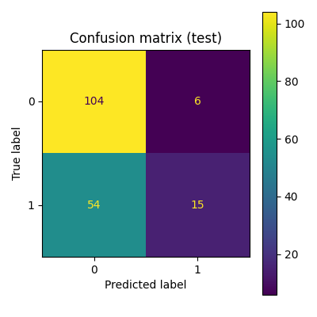

# Titanic Survival Prediction  

## Overview  
This project builds machine learning models to predict passenger survival on the **Titanic dataset**.  
It demonstrates a complete **end-to-end ML workflow**, including:  
- Data preprocessing (missing value imputation, encoding, scaling)  
- Exploratory Data Analysis (EDA) with visualization  
- Model development using **Logistic Regression** and **Perceptron** classifiers  
- Performance evaluation with accuracy, precision, recall, and F1-score  
- Saving trained models for reproducibility and deployment  

This repository was developed as part of an advanced university **Deep-Learning** course.  

---

## Tech Stack  
- **Language**: Python (3.11+)  
- **Core Libraries**: scikit-learn, pandas, numpy, matplotlib, seaborn, joblib  
- **ML Techniques**: Logistic Regression, Perceptron (linear model, SGD-based)  
- **Pipeline Tools**: ColumnTransformer, GridSearchCV  

---

## Quick Start  

### 1. Clone repository  
```bash
git clone https://github.com/<your-username>/titanic-ml.git
cd titanic-ml
```

### 2. Set up environment  
```bash
python -m venv venv
source venv/bin/activate    # macOS/Linux
venv\Scripts\activate       # Windows
```

### 3. Run scripts  
```bash
python src/eda_titanic.py  # Exploratory Data Analysis
python src/logistic_regression.py  # Logistic Regression Model
python src/perceptron.py  # Perceptron Model
```

### Outputs:
- Figures → figures/
- Reports → results/
- Models → models/

---

## Results (Summary)

| Model               | Train Accuracy | Test Accuracy | Notes |
|---------------------|---------------|---------------|-------|
| Logistic Regression | ~80%          | ~79.9%        | Balanced performance, stable generalization |
| Perceptron          | ~68.7%        | ~66.5%        | Strong bias toward non-survivors, weaker generalization |

- Logistic Regression outperformed the Perceptron in both accuracy and balance across classes.  
- Perceptron showed very high recall for non-survivors but very poor recall for survivors.  

---

## Example Visualization  

Confusion matrix (Logistic Regression, Test Set):  

  

---

## Contribution  

This repository is designed as an individual project but follows open-source practices.  
Suggestions and improvements are welcome via Issues or Pull Requests.  

---

## Author  

**Azmi Abidi**  
- 🎓 Software Engineering Student @ Concordia University  
- 💻 Interests: Machine Learning, Data Science, Full-Stack Development  
- 🌐 [LinkedIn](https://www.linkedin.com/in/azmi-abidi/) 
